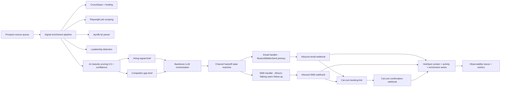

# Z Conversion Engine

Production-style multi-channel lead conversion engine for the TRP1 Week 10 Tenacious challenge.

## Architecture

### Design rationale

- Email is primary for Tenacious personas (founders/CTOs/VP Eng), while SMS is explicitly gated as warm follow-up after an email reply.
- Handoff logic is centralized in `agent/services/conversation_service.py` to avoid scattered channel decisions.
- Enrichment runs before any outbound generation to keep messaging grounded and auditable.
- HubSpot receives writes at multiple event points (enrichment, conversation events, consent changes, calendar events).
- Cal.com link generation is included in both email and SMS paths for consistent booking UX.
- Observability stores both interaction traces and evaluation traces, supporting evidence-graph backtracking.

## Setup and Bootstrapping

### Prerequisites

- Python `3.11+` (tested on 3.12)
- Node.js `18+` (for optional HubSpot CLI operations)
- Playwright browser runtime (`python -m playwright install`)
- Docker Desktop (for optional local Cal.com stack)

### Pinned dependencies

See `agent/requirements.txt`:
- `fastapi==0.115.12`
- `uvicorn==0.34.2`
- `pydantic==2.11.4`
- `httpx==0.28.1`
- `playwright==1.52.0`

### Environment variables

- `APP_ENV`: `dev`/`production` runtime mode.
- `ENABLE_LIVE_SENDING`: controls real provider sends.
- `TENACIOUS_OUTBOUND_ENABLED`: kill switch. When unset/false, outbound is routed to safe sink mode.
- `EMAIL_PROVIDER`: `resend` or `mailersend`.
- `RESEND_API_KEY`, `MAILERSEND_API_KEY`: email provider credentials.
- `AFRICASTALKING_USERNAME`, `AFRICASTALKING_API_KEY`: SMS credentials.
- `HUBSPOT_ACCESS_TOKEN`, `HUBSPOT_APP_ID`, `HUBSPOT_PORTAL_ID`: CRM integration.
- `CALCOM_API_KEY`: calendar integration.
- `OPENROUTER_API_KEY`: backbone model provider key.
- `LANGFUSE_PUBLIC_KEY`, `LANGFUSE_SECRET_KEY`, `LANGFUSE_BASE_URL`: observability sink.
- `SEED_REPO_PATH`: path to Tenacious seed data used by enrichment.

### Run order (local)

1. Create and activate environment:
   - `python -m venv .venv`
   - `.venv\Scripts\activate`
2. Install dependencies:
   - `pip install -r agent\requirements.txt`
3. Install Playwright browser:
   - `python -m playwright install`
4. Verify HubSpot auth:
   - `python scripts\hubspot_check.py`
5. Start API:
   - `uvicorn agent.main:app --host 127.0.0.1 --port 8000`
6. Optional smoke data:
   - `python agent\seed_demo_data.py`
7. API smoke test:
   - `python -c "import httpx; print(httpx.get('http://127.0.0.1:8000/health').json())"`

## Directory Index (Top-Level)

- `.cursor/`: local editor/agent project metadata and command helpers.
- `agent/`: runtime application code (API, adapters, enrichment, handoff logic, data output).
- `eval/`: benchmark harness and score/trace artifacts.
- `probes/`: adversarial probe library, taxonomy, and target failure analysis.
- `method/`: mechanism design, ablation plan/results, held-out trace placeholders.
- `evidence/`: evidence graph and invoice/cost mapping artifacts.
- `memo/`: final decision memo draft and appendix source.
- `docs/`: submission checklists and operator notes.
- `scripts/`: utility scripts for checks and local bootstrap.
- `zconver/`: extra local workspace copy; not used by the main runtime.
- `baseline.md`: baseline summary document.
- `interim_report.md`: interim report document.
- `render.yaml`: Render deployment blueprint.

## Key API Endpoints

- `GET /health`
- `POST /leads/process`
- `POST /outbound/email`
- `POST /outbound/sms`
- `POST /webhooks/resend`
- `POST /webhooks/africastalking`
- `POST /webhooks/cal`
- `POST /webhooks/hubspot`
- `GET /metrics/latency`

## Demo Script (Final Submission)

1. Start backend:
   - `uvicorn agent.main:app --host 0.0.0.0 --port 8010`
2. Run deterministic smoke artifact generation:
   - `python scripts\final_smoke_test.py`
   - confirm output in `docs/final_smoke_test_output.json`
3. Start frontend dashboard:
   - `cd frontend`
   - `npm install`
   - `npm run dev`
   - open `http://127.0.0.1:3000`
4. In UI:
   - click `Run Full Flow` for full test sequence
   - or run step-by-step buttons and present each output card
   - click `Load Final Smoke Artifact` to display stored deterministic output
5. Capture evidence using `docs/final_submission_checklist.md`.

## Handoff Notes: Known Limitations and Next Steps

- HubSpot integration currently supports direct API fallback; MCP-native runtime calls can be added as a drop-in client wrapper.
- Playwright scraper includes robust fallback for inaccessible pages; add persistent crawl cache for large batch runs.
- Competitor-gap peer evidence currently uses deterministic placeholders for some URLs; plug live evidence crawls for final production confidence.
- Langfuse is configured by env but not yet mandatory in local smoke tests; enforce trace export in CI before final deployment.
- `zconver/` duplicate workspace can be removed to reduce operator confusion.

## Render Deployment

1. Push repo to GitHub.
2. In Render: **New +** -> **Blueprint**.
3. Confirm:
   - Build: `pip install -r agent/requirements.txt`
   - Start: `uvicorn agent.main:app --host 0.0.0.0 --port $PORT`
4. Register webhooks:
   - `https://<render-domain>/webhooks/resend`
   - `https://<render-domain>/webhooks/africastalking`
   - `https://<render-domain>/webhooks/cal`
   - `https://<render-domain>/webhooks/hubspot`
