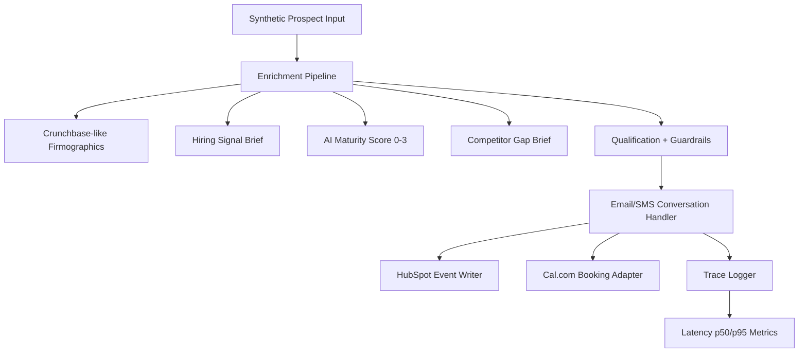

# Z Conversion Engine (Interim Submission: Acts I + II)

This repository contains an interim-ready implementation for the Week 10 Conversion Engine challenge tailored to Tenacious Consulting and Outsourcing.

## Architecture

## Repository Layout

- `agent/`
  - `main.py`: FastAPI runtime app.
  - `adapters/`: provider boundaries for email, SMS, HubSpot, calendar, tracing.
  - `enrichment/`: Crunchbase, hiring-signal, and competitor-gap modules.
  - `guardrails/`: policy checks (over-claim prevention hooks).
  - `services/`: orchestration services.
  - `models/`: schema layer.
  - `config.py`, `requirements.txt`, `seed_demo_data.py`, `data/`.
- `eval/`
  - `run_tau2_baseline.py`: current baseline harness.
  - `harness/`: dev-slice and held-out runner placeholders.
  - `configs/`: pinned model settings template.
  - `artifacts/`: generated eval outputs.
  - `score_log.json`, `trace_log.jsonl`.
- `probes/`: Act III files (`probe_library.md`, `failure_taxonomy.md`, `target_failure_mode.md`).
- `method/`: Act IV files (`method.md`, `ablation_results.json`, `held_out_traces.jsonl`).
- `evidence/`: claim-to-trace/invoice mapping files.
- `memo/`: Act V memo draft.
- `docs/`: submission checklist.
- `scripts/`: bootstrap/export helper scripts.
- Root docs: `baseline.md`, `interim_report.md`.

## Setup

1. Create venv and install:
   - `python -m venv .venv`
   - `.venv\Scripts\activate`
   - `pip install -r agent\requirements.txt`
2. Start API:
   - `uvicorn agent.main:app --reload --port 8000`
3. Seed interaction traces:
   - `python agent\seed_demo_data.py`
4. Generate eval artifacts:
   - `python eval\run_tau2_baseline.py`

## Key Endpoints

- `GET /health`
- `POST /leads/process`
  - Runs enrichment + qualification and writes a HubSpot event.
  - Books a synthetic Cal event when lead is qualified.
- `POST /webhooks/inbound`
  - Handles `email` and `sms` interactions.
  - STOP/HELP/UNSUB compliance handling included.
- `POST /webhooks/resend`
  - Resend inbound/reply webhook endpoint.
- `POST /webhooks/africastalking`
  - Africa's Talking SMS callback endpoint.
- `POST /webhooks/cal`
  - Cal.com booking webhook endpoint.
- `POST /webhooks/hubspot`
  - Optional HubSpot app webhook endpoint.
- `GET /metrics/latency`
  - Returns count, p50, p95, and mean from interaction traces.

## Interim Status (Acts I + II)

- Act I eval artifacts generated:
  - `eval/score_log.json`
  - `eval/trace_log.jsonl`
- Act II stack scaffolded:
  - Email/SMS webhook handling in place.
  - HubSpot/Cal integration adapters implemented as structured event sinks.
  - Enrichment pipeline produces `hiring_signal_brief` and `competitor_gap_brief`.
- Latency computed from 20 interactions:
  - p50: `2855ms`
  - p95: `5787ms`

## Notes

- This submission is challenge-safe and synthetic-data-first.
- Replace adapter sinks with live provider clients (Resend/MailerSend, Africa's Talking, HubSpot MCP, Cal.com API) by updating the adapter functions in `agent/main.py`.

## Render Deployment (Recommended)

This repo includes `render.yaml` for Render free-tier deployment.

1. Push this repository to GitHub.
2. In Render, choose **New +** -> **Blueprint** and select the repo.
3. Render will read `render.yaml` and deploy `uvicorn agent.main:app`.
4. After deploy, copy your public base URL, then register:
   - Resend webhook: `https://<your-render-url>/webhooks/resend`
   - Africa's Talking callback: `https://<your-render-url>/webhooks/africastalking`
   - Cal.com webhook: `https://<your-render-url>/webhooks/cal`
   - HubSpot webhook (optional): `https://<your-render-url>/webhooks/hubspot`
5. Set env vars in Render dashboard using `.env.example` as reference.
