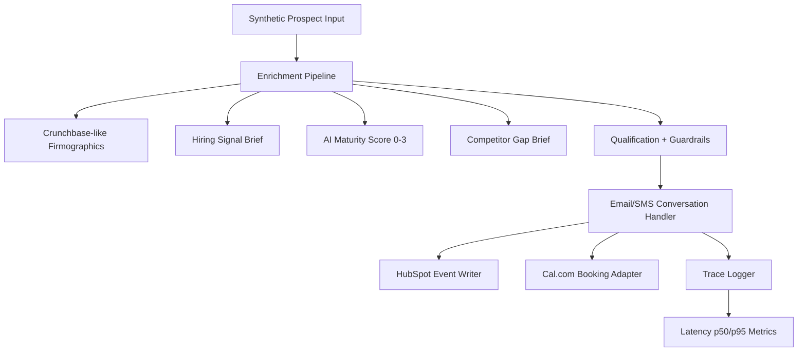

# Z Conversion Engine (Interim Submission: Acts I + II)

This repository contains an interim-ready implementation for the Week 10 Conversion Engine challenge tailored to Tenacious Consulting and Outsourcing.

## Architecture

## Repository Layout

- `agent/`
  - `main.py`: FastAPI app with email/SMS webhook handlers, qualification logic, enrichment pipeline, HubSpot and Cal adapters.
  - `seed_demo_data.py`: creates 20 synthetic interaction traces for latency reporting.
  - `requirements.txt`: Python dependencies.
  - `data/`: generated runtime artifacts (`interaction_traces.jsonl`, `hubspot_events.jsonl`, `cal_bookings.jsonl`).
- `eval/`
  - `run_tau2_baseline.py`: baseline and reproduction scoring harness.
  - `score_log.json`: Act I baseline metrics (mean pass@1, 95% CI, cost, latency).
  - `trace_log.jsonl`: trajectory-level traces for eval runs.
- `baseline.md`: <=400 word baseline note.
- `interim_report.md`: interim PDF-source content (export to PDF).

## Setup

1. Create venv and install:
   - `python -m venv .venv`
   - `.venv\Scripts\activate`
   - `pip install -r agent\requirements.txt`
2. Start API:
   - `uvicorn agent.main:app --reload --port 8000`
3. Seed interaction traces:
   - `python agent\seed_demo_data.py`
4. Generate eval artifacts:
   - `python eval\run_tau2_baseline.py`

## Key Endpoints

- `GET /health`
- `POST /leads/process`
  - Runs enrichment + qualification and writes a HubSpot event.
  - Books a synthetic Cal event when lead is qualified.
- `POST /webhooks/inbound`
  - Handles `email` and `sms` interactions.
  - STOP/HELP/UNSUB compliance handling included.
- `GET /metrics/latency`
  - Returns count, p50, p95, and mean from interaction traces.

## Interim Status (Acts I + II)

- Act I eval artifacts generated:
  - `eval/score_log.json`
  - `eval/trace_log.jsonl`
- Act II stack scaffolded:
  - Email/SMS webhook handling in place.
  - HubSpot/Cal integration adapters implemented as structured event sinks.
  - Enrichment pipeline produces `hiring_signal_brief` and `competitor_gap_brief`.
- Latency computed from 20 interactions:
  - p50: `2855ms`
  - p95: `5787ms`

## Notes

- This submission is challenge-safe and synthetic-data-first.
- Replace adapter sinks with live provider clients (Resend/MailerSend, Africa's Talking, HubSpot MCP, Cal.com API) by updating the adapter functions in `agent/main.py`.
