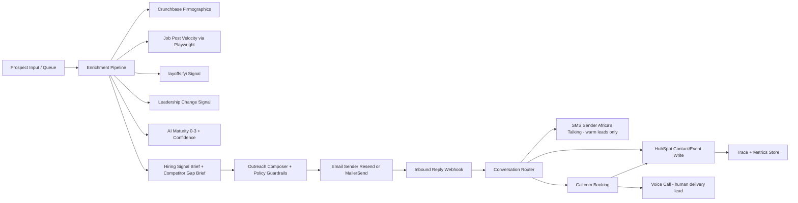

# Interim Report (Acts I + II)

## 1) System Architecture Diagram and Design Rationale

Design rationale:

- Email is primary because Tenacious prospects (founders/CTOs/VP Eng) are email-native; cold SMS is lower-trust and reserved for warm scheduling.
- SMS is secondary and gated after an email reply to enforce channel hierarchy and reduce brand risk.
- Voice is final delivery by human lead after booking; this preserves high-trust commercial conversations for humans.
- Enrichment runs before outreach so the first message is signal-grounded, not generic.
- HubSpot and Cal.com are linked so booking events are reflected in CRM state for SDR visibility and traceability.
- FastAPI was selected for rapid webhook integration across providers with one public Render URL.

## 2) Production Stack Status Coverage

### Email Delivery (Resend/MailerSend)

- Tool configured: provider-switching adapter in `agent/adapters/email.py`.
- Capability verified: outbound endpoint `POST /outbound/email` executes and returns controlled sink-mode response when kill switch is off.
- Reply handling verified: `POST /webhooks/resend` handles reply-like events and bounce events.
- Error handling verified: malformed Resend payload returns HTTP 400 and logs to `agent/data/webhook_errors.jsonl`.
- Evidence: endpoint smoke test results captured in local run output and bounce logs in `agent/data/email_bounces.jsonl`.

### SMS (Africa's Talking)

- Tool configured: Africa's Talking adapter in `agent/adapters/sms.py`.
- Capability verified: inbound callbacks accepted via `POST /webhooks/africastalking` (form or JSON payload).
- Channel hierarchy verified: `POST /outbound/sms` rejects cold sends before email reply and allows after email reply marker.
- Routing verified: inbound SMS is routed to common conversation handler.
- Evidence: webhook test responses and SMS gate behavior observed in endpoint smoke test output.

### CRM (HubSpot)

- Tool configured: HubSpot write adapter in `agent/adapters/hubspot.py` plus event writes in `agent/main.py`.
- Capability verified: lead enrichment and conversation events write structured records to `agent/data/hubspot_events.jsonl`.
- Enrichment fields included: `segment_match`, `segment_confidence`, `enrichment_timestamp`, `tenacious_status`.
- Evidence: generated records in `agent/data/hubspot_events.jsonl`.

### Calendar (Cal.com)

- Tool configured: booking flow and booking webhook endpoint `POST /webhooks/cal`.
- Capability verified: booking event ingestion triggers linked HubSpot write for same lead.
- Evidence: `agent/data/cal_bookings.jsonl` and corresponding calendar event entries in `agent/data/hubspot_events.jsonl`.

### Observability

- Tool configured: JSONL traces for operational runs and eval runs.
- Capability verified: interaction traces in `agent/data/interaction_traces.jsonl`; eval traces in `eval/trace_log.jsonl`; latency endpoint in `GET /metrics/latency`.
- Evidence: trace files and latency metric output from test run.

## 3) Enrichment Pipeline Documentation

Pipeline implementation: `agent/enrichment/pipeline.py`, invoked from `POST /leads/process`.

### Signal 1: Crunchbase Firmographics/Funding

- Source: Crunchbase ODM-compatible lookup path.
- Output fields: `buying_window_signals.funding_event.detected`, `stage`, `amount_usd`, `closed_at`, `source_url`.
- Classification use: positive recent funding contributes to Segment 1 unless overridden by layoffs/leadership precedence.

### Signal 2: Job-Post Velocity (Playwright public scrape)

- Source: public careers pages via Playwright (no login path, no captcha bypass logic).
- Output fields: `hiring_velocity.open_roles_today`, `open_roles_60_days_ago`, `velocity_label`, `signal_confidence`, `sources`.
- Classification/pitch use: velocity and role count guide confidence and phrasing; low signal forces softer “ask vs assert” language.

### Signal 3: layoffs.fyi

- Source: layoffs.fyi CSV-compatible fetch path.
- Output fields: `buying_window_signals.layoff_event.detected`, `date`, `headcount_reduction`, `percentage_cut`, `source_url`.
- Classification use: layoff signal has precedence to Segment 2 in mixed-signal cases.

### Signal 4: Leadership Change Detection

- Source: public `news`/`blog` scanning for CTO/VP Engineering transition cues.
- Output fields: `buying_window_signals.leadership_change.detected`, `role`, `new_leader_name`, `started_at`, `source_url`.
- Classification use: leadership transition drives Segment 3 per rule ordering.

### Signal 5: AI Maturity Scoring

- High-weight inputs: AI-adjacent open roles, named AI/ML leadership.
- Medium-weight inputs: hiring intensity plus leadership signal context.
- Output fields: `ai_maturity.score` (0-3), `ai_maturity.confidence`, `ai_maturity.justifications[]`.
- Confidence-to-phrasing mapping:
  - High confidence: direct segment-specific positioning.
  - Medium confidence: qualified assertions with explicit signal references.
  - Low confidence: exploratory phrasing and abstention-safe language.

### Structured artifact and merge behavior

- Unified artifact: `hiring_signal_brief` with per-signal confidence, source status, and honesty flags.
- Additional fields: `data_sources_checked[]`, `honesty_flags[]`, `bench_to_brief_match`.
- Output is attached to lead record and propagated to CRM write path.

## 4) Act I Baseline and Metrics Snapshot

Artifacts in `eval/`:

- `score_log.json`
  - `dev_tier_baseline`: pass@1 mean 0.4333, 95% CI [0.3749, 0.4918]
  - `reproduction_check`: pass@1 mean 0.4000, 95% CI [0.3284, 0.4716]
- `trace_log.jsonl`: trajectory-level eval traces.

Operational latency evidence:

- `agent/data/interaction_traces.jsonl` + `GET /metrics/latency`.
- Current run snapshot: p50/p95 available from endpoint and trace logs.

## 5) Honest Status Report and Forward Plan

### Working now

- End-to-end lead processing with enrichment and classification artifacts.
- Email/SMS inbound webhook handling with shared downstream routing.
- SMS warm-lead gating enforced (blocked pre-email-reply; allowed post-email-reply).
- Bounce and malformed webhook handling paths (Resend webhook).
- Cal webhook -> HubSpot-linked update path.
- Eval baseline artifacts (Act I) generated and stored.

### Not fully working yet (specific failure/constraint details)

- Live outbound is intentionally disabled unless `TENACIOUS_OUTBOUND_ENABLED=true`; current tests run in safe sink mode.
- HubSpot MCP-native runtime path is not yet wired; current implementation uses direct API/stub fallback.
- Playwright job scraping includes deterministic fallback when career page fetch times out or page is unavailable.
- Langfuse direct sink is not yet connected; traces are local JSONL, not remote observability backend.
- Voice channel remains unimplemented for interim (expected bonus tier scope).

### Forward plan by day (Acts III-V)

- **Day 3 (Act III start):** build 30+ probe library (`probes/probe_library.md`) across misclassification, tone drift, over-claiming, and cost pathology.
- **Day 4:** compute trigger rates + business cost; finalize `failure_taxonomy.md` and `target_failure_mode.md`.
- **Day 5 (Act IV):** implement mechanism targeting top failure mode (confidence-aware phrasing + abstention policy); run ablation variants.
- **Day 6:** run held-out evaluation comparisons; produce `ablation_results.json` and `held_out_traces.jsonl`; verify Delta A statistical significance.
- **Day 7 (Act V):** complete `memo.pdf` (2 pages), `evidence_graph.json`, and demo flow with auditable trace references.
